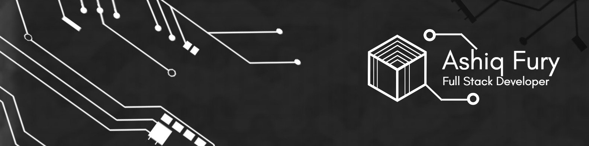

<p align="center">
  
</p>

<br />
<!--  -->

<a href="https:github.com/ashiqfury">

</a>

<br />
<br />
<br />

<h2 align="center" style="font-weight: 800;">About me</h2>

<div style="box-shadow: 0 0 10px rgba(0,0,0,0.15), 0 0 40px rgba(0,0,0,0.15);">

```javascript
import Stupidity from 'fury';

const author = 'ashiqfury';

const greet = () => {
	if (Stupidity.author === 'ashiqfury') {
		console.log('Hi..! fury..');
	}
};

const getBio = () => {
	return (Bio = {
		'- ⚡ Quick bio:':
			'A kind of selfLearner-fictionReader-positivePerson-bathroomSinger-traveler-foodLover-gamer-coder-programmer-catLover-dancer-loveRat❤️',
		'- 🔭 I’m currently studying':
			'Bachelor of Computer Science in India --- Self learning programmer',
		'- 🌱 I’m currently learning':
			'React, Node, Express, React Native, MySQL, MongoDB --- Sharpening my Front End Skills for the MERN stack (Personal goal)',
		'- 👯 I’m looking to collaborate on':
			'Python, Javascript and React related projects',
		'- 🤔 I’m looking for help with':
			'Anything related to what I am currently learning 😅',
		'- 💬 Ask me about':
			'Python, PHP, React, Node, Express, SQL, Software Design & Architecture, Web-Dev and SEO',
		'- 📫 How to reach me:': 'https://github.com/ashiqfury',
	});
};
```

</div>

<br />
<hr color="purple"/>
<br />

<h3 align="center" style="font-weight: 800;">Top languages using 🎵</h4>

<p align="center"></p>

<br />

<h3 align="center" style="font-weight: 800;">Profile stats 🏆</h3>

<p align="center"></p>

</h2>

<br/>

<h3 align="center" style="font-weight: 800;">Codewars stats 🏆</h3>

<p align="center"></p>


<br />
<hr/>
<br />


<div align="left">

- <a href="https://www.instagram.com/_a.s.h.i.q__f.u.r.y_/"></a>
- <a href="https://www.linkedin.com/in/ashiq-fury-1224a9205/"></a>
- <a href="https://www.faceboook.com/ashiqfury/"></a>
- <a href="https://twitter.com/ashiqfury/"></a>
- <a href="https://github.com/ashiqfury/"></a>

<br />

<!-- 8E2DE2 -->


<br>


<br>


<br>


</div>
<br />



⭐️ From [ashiqfury](https://github.com/ashiqfury)
